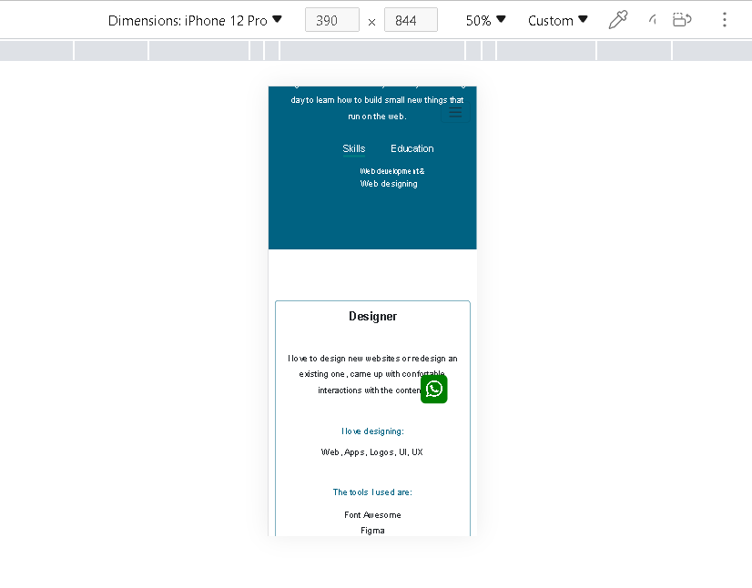
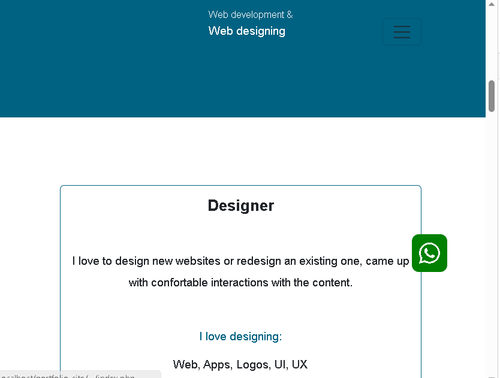

         #Example Code of a Simple  Responsive Portfolio Websites

This is a simple full stack portfolio websites code which is mobile first.

Laguages used:
PHP
JavaScript
CSS
Html
SQL

Technologies used:
font awesomee
bootstrap
MYSQL

-To run this project the user needs to have MYSQL databse installed.
-The user need to create a databse name and table similar to the one in the connectDB.php and procesPort.php file or make necessary adjustments.
- The user needs to have a web server.I recommend warm server or Aparch server.
-The user needs bootstrap5.3.You can download bootstrap in the link below https://getbootstrap.com/docs/5.3/getting-started/introduction/#cdn-links
 and  add the cdn links to the head section of every file execpt for the connectDB.php and the processPort.pph files.
-The sendmail.php files need to be adjusted with respect to the users hosting information.

#The images below shows the code  on different screen sizes.This code is responsive and mobile first.

